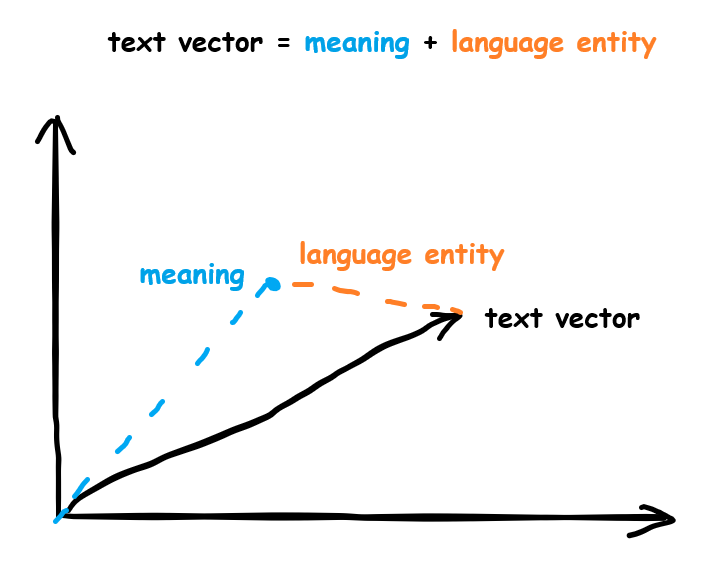
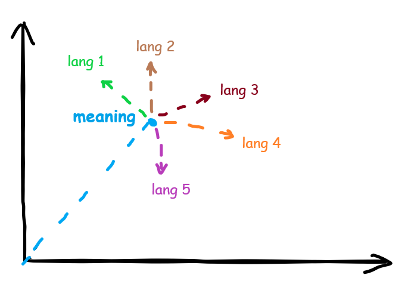
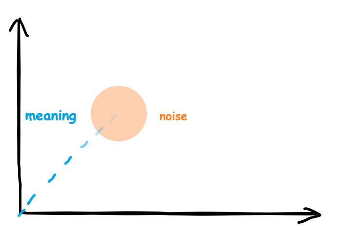
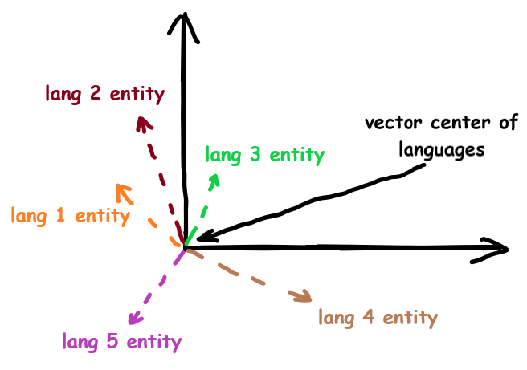

# Multi Language RAG
## Problem
I was faced with a problem when I had a vector database (embeddings) of texts for LLM in different languages. 
And the information differs in different languages. When searching using cosine similarity, the result depends on the similarity of languages  
>Example:   
2 texts in languages A and B talk about the same topic, but the details are different.   
The question comes in language A, but the meaning of the text in language B is more suitable. 
The search may yield a higher rate for language A, simply due to the similarity of the languages.

As we know, each embedding element carries a numerical representation of input information to neural network. 
The nuance is that each parameter does not necessarily correspond to which parameter we humans use. 
For example, a small model has a vector of size 768. And it is not necessary that among them there is **only one** number responsible for the volume. 
Loudness can be expressed through several numbers. 
This depends on how the model, during the training process, understood by what abstract parameters to separate information.

---
## Introduction
In 2013, data scientists discovered an interesting trick:  
If we take the vector of the word: king, subtract from it the vector of the word man, 
add the vector of the word woman, we get a vector with the meaning of the word queen.

<center></center>

nice explanation [here](https://blog.acolyer.org/2016/04/21/the-amazing-power-of-word-vectors/)  

---
## Maybe there is a vector entity that describes language of the text?
In this case, each text has meaning and information about the language.  
<center></center>

When I search by cosine similarity between vectors, I get the meaning similarity coefficient plus the language similarity coefficient.  
To get search results based only on meaning, I need to remove language entity from texts.  

---
## Create language entity
I decided to solve that problem thru finding meanings of different texts, 
removing them from that text vectors and averaging values of vector.  
To find vector of text meaning I generated 3 sentences for 20 different themes. Then translated them to 22 other languages.  

    Total:
        23 languages  
        20 + 1 themes  
        (20 + 1) * 3 = 63 sentences (1 language)

If I find average value of vectors from same sentence in all languages it will be **approximately** vector of text meaning without language entity.
<center></center>


### Now codding starts
**Imports and download data:**  

```python
import openai
import pandas as pd
import numpy as np
```
```python
openai.api_key = "YOUR_API_KEY"
```
```python
languages = ['English', 'Spanish', 'French', 'German', 'Italian', 'Dutch', 'Russian', 'Chinese', 'Japanese', 'Korean',
'Arabic', 'Portuguese', 'Swedish', 'Norwegian', 'Danish', 'Finnish', 'Hindi', 'Turkish', 'Greek', 'Polish', 'Czech', 'Ukrainian', 'Hebrew']

# already generated texts
text_data = pd.read_csv('https://raw.githubusercontent.com/Otnielush/Language_entity_embeddings/main/data/text_data.csv', encoding='utf-8')
```
in 'text_data' first column is theme of sentences  
21 rows and 70 columns

```python
import requests
import io

# converted to embeddings with OpenAI text-embedding-3-small
response = requests.get('https://raw.githubusercontent.com/Otnielush/Language_entity_embeddings/main/data/embd_data.npy')
response.raise_for_status()
embd_np = np.load(io.BytesIO(response.content))
```
21 row, 69 columns and 1536 dimention of embeddings vector

---
We got data, now averaging meanings of sentences  
```python
meanings = np.zeros((21, 3, 1536))  # 21 themes, 3 different sentences for each language
for i in range(int(embd_np.shape[1] / 3)):
    meanings += embd_np[:, i * 3: (i+1) * 3]

meanings /= int(embd_np.shape[1] / 3)
```
Each averaged vector of sentence meaning contains meaning + noise 
<center></center>

noise comes from information about language entity, because by averaging different languages we can`t nulify their 
entity from vector. Actually we found center point in vector space for languages in dataset.  
Also noise contains differences in word meanings for different languages.  
For example: 
- *Tsunami* (eng) - in english series of ocean waves with extremely long wavelengths and period, usually caused by a large-scale disturbance of the sea.
But in Japanese, it can also be used to describe something enormous, overwhelming, or unstoppable.
- *Preservative* (eng) - refers to a substance used to prevent the decay or spoilage of food, beverages, and other perishable items.
In Japanese **ホルマリン** (chorumarin), which also means "formaldehyde". In Japan, the word is often used in a negative context, implying that the product contains potentially dangerous chemicals.
Claude ©
---
Next step we subtract averaged meaning vectors from corresponding vectors in each language.  
Remaining information will be distance of current language from center of our languages.  
Averaging entities for each language from 3 different sentences.
<center></center>


```python
def get_embedding(text: str, model="text-embedding-3-small", **kwargs):
    # replace newlines, which can negatively affect performance.
    text = text.replace("\n", " ")
    response = openai.embeddings.create(input=[text], model=model, **kwargs)
    return response.data[0].embedding
```
```python
def calc_cos_sim(vector_a, vector_b):
    # Compute the dot product of the two vectors
    dot_product = np.dot(vector_a, vector_b)
    # Compute the L2 norms (magnitudes) of each vector
    norm_a = np.linalg.norm(vector_a)
    norm_b = np.linalg.norm(vector_b)
    # Compute the cosine similarity
    # Note: We add a small epsilon value to the denominator for numerical stability
    epsilon = 1e-10
    cosine_similarity = dot_product / (norm_a * norm_b + epsilon)
    
    return cosine_similarity
```
function test:  
```python
embeddings = get_embedding("yellow red apple on tree branch")
len(embeddings)
```   
*1536*


